# Perk Emoji
| emoji | name |
| ----- | ---- |
| 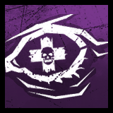 | zANursesCalling | 
| 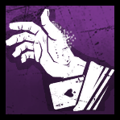 | zAceInTheHole | 
| 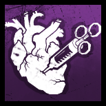 | zAdrenaline | 
| 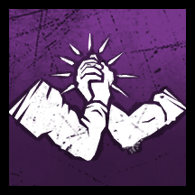 | zAftercare | 
| 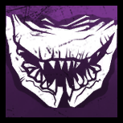 | zAgitation | 
| 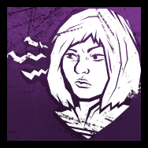 | zAlert | 
| 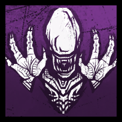 | zAlienInstinct | 
| 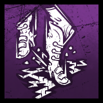 | zAllshakingThunder | 
| 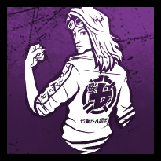 | zAnyMeansNecessary | 
| 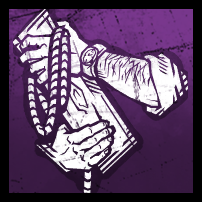 | zApocalypticIngenuity | 
|  | zAppraisal | 
| 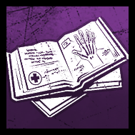 | zAutodidact | 
| 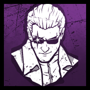 | zAwakenedAwareness | 
| 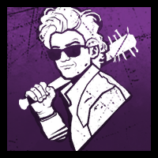 | zBabysitter | 
| 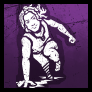 | zBackgroundPlayer | 
| 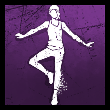 | zBalancedLanding | 
| 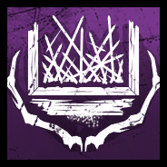 | zBamboozle | 
| 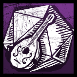 | zBardicInspiration | 
| 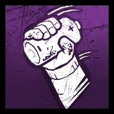 | zBatteriesIncluded | 
| 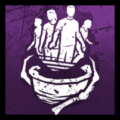 | zBbqAndChili | 
| 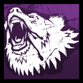 | zBeastOfPrey | 
| 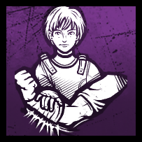 | zBetterThanNew | 
| 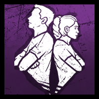 | zBetterTogether | 
| 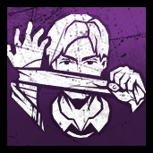 | zBiteTheBullet | 
| 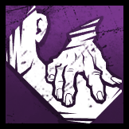 | zBitterMurmur | 
| 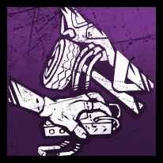 | zBlastMine | 
|  | zBloodEcho | 
| 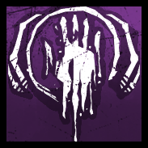 | zBloodPact | 
| 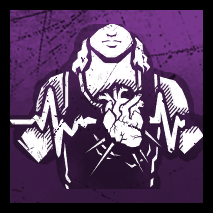 | zBloodRush | 
| 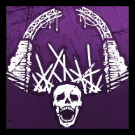 | zBloodWarden | 
| 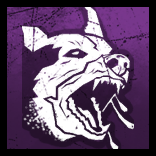 | zBloodhound | 
| 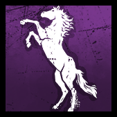 | zBoilOver | 
| 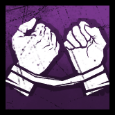 | zBond | 
| 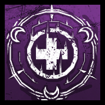 | zBoonCircleOfHealing | 
| 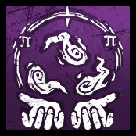 | zBoonExponential | 
| 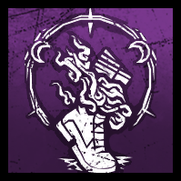 | zBoonShadowStep | 
|  | zBorrowedTime | 
| 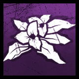 | zBotanyKnowledge | 
| 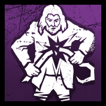 | zBreakdown | 
| 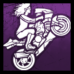 | zBreakout | 
| 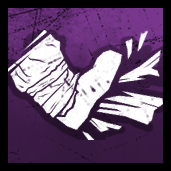 | zBrutalStrength | 
| 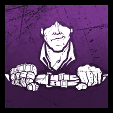 | zBuckleUp | 
| 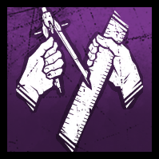 | zBuiltToLast | 
| 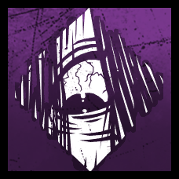 | zCallOfBrine | 
| 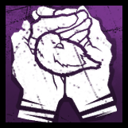 | zCalmSpirit | 
| 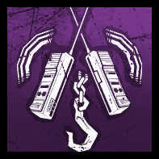 | zCamaraderie | 
| 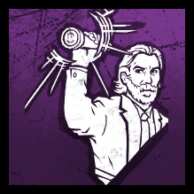 | zChampionOfLight | 
| 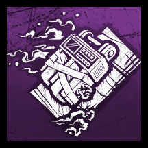 | zChemicalTrap | 
|  | zClairvoyance | 
| 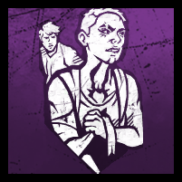 | zCleanBreak | 
| 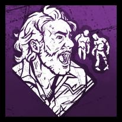 | zComeAndGetMe | 
| 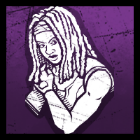 | zConviction | 
| 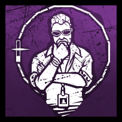 | zCorrectiveAction | 
| 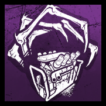 | zCorruptIntervention | 
|  | zCoulrophobia | 
|  | zCounterforce | 
|  | zCoupDeGrace | 
|  | zCruelLimits | 
|  | zCutLoose | 
|  | zDanceWithMe | 
|  | zDarkArrogance | 
|  | zDarkDevotion | 
|  | zDarkSense | 
|  | zDarkTheory | 
|  | zDarknessRevealed | 
|  | zDeadHard | 
|  | zDeadMansSwitch | 
|  | zDeadline | 
|  | zDeadlock | 
|  | zDeathbound | 
|  | zDeception | 
|  | zDecisiveStrike | 
|  | zDeerstalker | 
|  | zDejaVu | 
|  | zDeliverance | 
|  | zDesperateMeasures | 
|  | zDetectivesHunch | 
|  | zDiscordance | 
|  | zDissolution | 
|  | zDistortion | 
|  | zDistressing | 
|  | zDiversion | 
|  | zDoNoHarm | 
|  | zDominance | 
|  | zDragonsGrip | 
|  | zDramaturgy | 
|  | zDutyOfCare | 
|  | zDyingLight | 
|  | zEmpathicConnection | 
|  | zEmpathy | 
|  | zEnduring | 
|  | zEruption | 
|  | zExultation | 
|  | zEyesOfBelmont | 
|  | zFastTrack | 
|  | zFinesse | 
|  | zFireUp | 
|  | zFixated | 
|  | zFlashbang | 
|  | zFlipFlop | 
|  | zFogwise | 
|  | zForThePeople | 
|  | zForcedHesitation | 
|  | zForcedPenance | 
|  | zForeverEntwined | 
|  | zFranklinsDemise | 
|  | zFriendlyCompetition | 
|  | zFriendsTilTheEnd | 
|  | zFurtiveChase | 
|  | zGameAfoot | 
|  | zGearhead | 
|  | zGeneticLimits | 
|  | zGhostNotes | 
|  | zGrimEmbrace | 
|  | zGuardian | 
|  | zHangmansTrick | 
|  | zHardened | 
|  | zHaywire | 
|  | zHeadOn | 
|  | zHelpWanted | 
|  | zHexBloodFavor | 
|  | zHexCrowdControl | 
|  | zHexDevourHope | 
|  | zHexFaceTheDarkness | 
|  | zHexFortunesFool | 
|  | zHexHauntedGround | 
|  | zHexHuntressLullaby | 
|  | zHexNoOneEscapesDeath | 
|  | zHexNothingButMisery | 
|  | zHexOvertureOfDoom | 
|  | zHexPentimento | 
|  | zHexPlaything | 
|  | zHexRetribution | 
|  | zHexRuin | 
|  | zHexThirdSeal | 
|  | zHexThrillOfTheHunt | 
|  | zHexTwoCanPlay | 
|  | zHexUndying | 
|  | zHexWretchedFate | 
|  | zHoarder | 
|  | zHope | 
|  | zHubris | 
|  | zHumanGreed | 
|  | zHyperfocus | 
|  | zHysteria | 
|  | zIllumination | 
|  | zImAllEars | 
|  | zInfectiousFright | 
|  | zInnerFocus | 
|  | zInnerStrength | 
|  | zInsidious | 
|  | zInvocationTreacherousCrows | 
|  | zInvocationWeavingSpiders | 
|  | zIronGrasp | 
|  | zIronMaiden | 
|  | zIronWill | 
|  | zKindred | 
|  | zKnockOut | 
|  | zLanguidTouch | 
|  | zLastStand | 
|  | zLeader | 
|  | zLeftBehind | 
|  | zLethalPursuer | 
|  | zLeverage | 
|  | zLightborn | 
|  | zLightfooted | 
|  | zLightweight | 
|  | zLithe | 
|  | zLowProfile | 
|  | zLuckyBreak | 
|  | zLuckyStar | 
|  | zMachineLearning | 
|  | zMadGrit | 
|  | zMadeForThis | 
|  | zMakeYourChoice | 
|  | zMercilessStorm | 
|  | zMettleOfMan | 
|  | zMindbreaker | 
|  | zMirroredIllusion | 
|  | zMomentOfGlory | 
|  | zMonitorAndAbuse | 
|  | zNemesis | 
|  | zNoHoldsBarred | 
|  | zNoMither | 
|  | zNoOneLeftBehind | 
|  | zNoQuarter | 
|  | zNoWayOut | 
|  | zNoneAreFree | 
|  | zNowhereToHide | 
|  | zObjectOfObsession | 
|  | zOffTheRecord | 
|  | zOneTwoThreeFour | 
|  | zOpenhanded | 
|  | zOppression | 
|  | zOvercharge | 
|  | zOvercome | 
|  | zOverwhelmingPresence | 
|  | zOverzealous | 
|  | zParentalGuidence | 
|  | zPhantomFear | 
|  | zPharmacy | 
|  | zPlayWithYourFood | 
|  | zPlotTwist | 
|  | zPlunderersInstinct | 
|  | zPoised | 
|  | zPopGoesTheWeasel | 
|  | zPotentialEnergy | 
|  | zPowerStruggle | 
|  | zPredator | 
|  | zPremonition | 
|  | zProveThyself | 
|  | zQuickAndQuiet | 
|  | zQuickGambit | 
|  | zRancor | 
|  | zRapidBrutality | 
|  | zRapidResponse | 
|  | zRavenous | 
|  | zReactiveHealing | 
|  | zReassurance | 
|  | zRedHerring | 
|  | zRememberMe | 
|  | zRenewal | 
|  | zRepressedAlliance | 
|  | zResidualManifest | 
|  | zResilience | 
|  | zResurgence | 
|  | zRoadLife | 
|  | zRookieSpirit | 
|  | zSaboteur | 
|  | zSaveTheBestForLast | 
|  | zScavenger | 
|  | zScenePartner | 
|  | zScourgeHookFloodsOfRage | 
|  | zScourgeHookGiftOfPain | 
|  | zScourgeHookJaggedCompass | 
|  | zScourgeHookMonstrousShrine | 
|  | zScourgeHookPainResonance | 
|  | zScourgeHookWeepingWounds | 
|  | zSecondWind | 
|  | zSelfCare | 
|  | zSelfPreservation | 
|  | zSepticTouch | 
|  | zShadowborn | 
|  | zShatteredHope | 
|  | zShoulderTheBurden | 
|  | zSituationalAwareness | 
|  | zSlipperyMeat | 
|  | zSloppyButcher | 
|  | zSmallGame | 
|  | zSmashHit | 
|  | zSoleSurvivor | 
|  | zSolidarity | 
|  | zSoulGuard | 
|  | zSpecialist | 
|  | zSpiesFromTheShadows | 
|  | zSpineChill | 
|  | zSpiritFury | 
|  | zSprintBurst | 
|  | zStakeOut | 
|  | zStarstruck | 
|  | zStillSight | 
|  | zStreetwise | 
|  | zStrengthInShadows | 
|  | zStridor | 
|  | zSuperiorAnatomy | 
|  | zSurge | 
|  | zSurveillance | 
|  | zSurvivialInstincts | 
|  | zTeamworkCollectiveStealth | 
|  | zTeamworkPowerOfTwo | 
|  | zTeamworkThrowDown | 
|  | zTeamworkToughenUp | 
|  | zTechnician | 
|  | zTenacity | 
|  | zTerminus | 
|  | zTerritorialImperative | 
|  | zThanatophobia | 
|  | zThisIsNotHappening | 
|  | zThrillingTremors | 
|  | zThwack | 
|  | zTinkerer | 
|  | zTrailOfTorment | 
|  | zTroubleshooter | 
|  | zUltimateWeapon | 
|  | zUnbound | 
|  | zUnbreakable | 
|  | zUndone | 
|  | zUnforeseen | 
|  | zUnnervingPresence | 
|  | zUnrelenting | 
|  | zUpTheAnte | 
|  | zUrbanEvasion | 
|  | zVigil | 
|  | zVisionary | 
|  | zWakeUp | 
|  | zWanderingEye | 
|  | zWeaveAttunement | 
|  | zWellMakeIt | 
|  | zWereGonnaLiveForever | 
|  | zWhispers | 
|  | zWicked | 
|  | zWindowsOfOpportunity | 
|  | zWiretap | 
|  | zZanshinTactics | 
